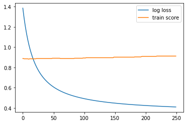
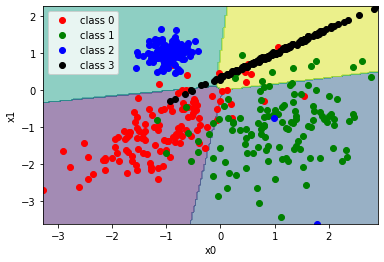

# SoftMaxRegression

https://youtu.be/8LEM5CAL8Ns

Algorithm for multiclass classification problem, based on Linear Regression with gradient descent.
For multiclass it one hot encode target. The result of that models passed through SoftMax function.
As a predicted class is being selected the highest value.

This implementation plots test train errors

Also plots classification results

